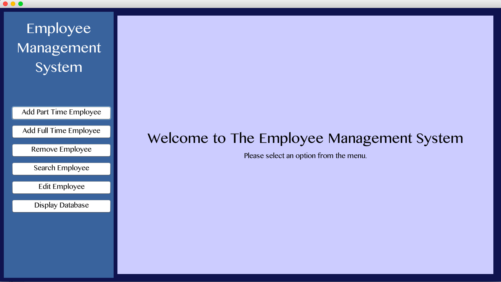

# EmployeeDatabase

Database system to organize employee information for small businesses.

## Program Screen Shots

## Reflection

I created Employee Database as my final project for my grade 12 computer science class. It was my first time utilizing the Eclipse IDE to create a Java database program. I was also able to learn a lot about implementing linked lists for data storage and organization. 
